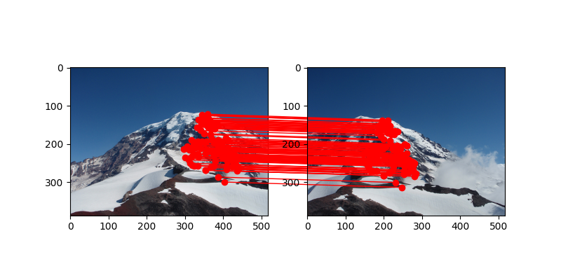
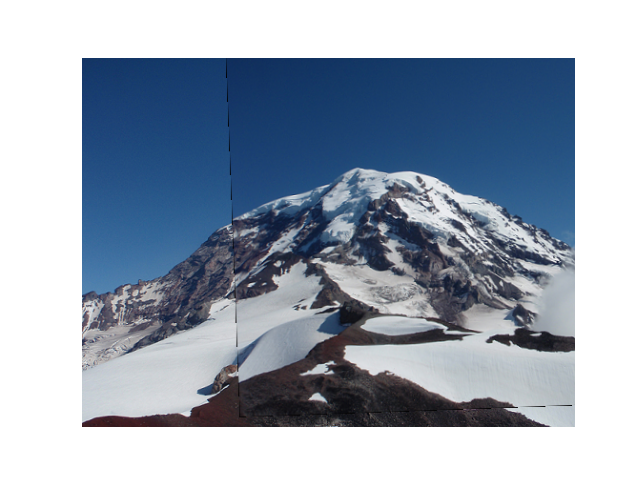
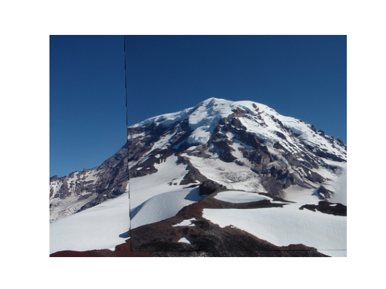
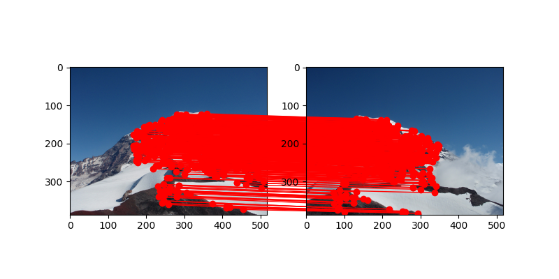
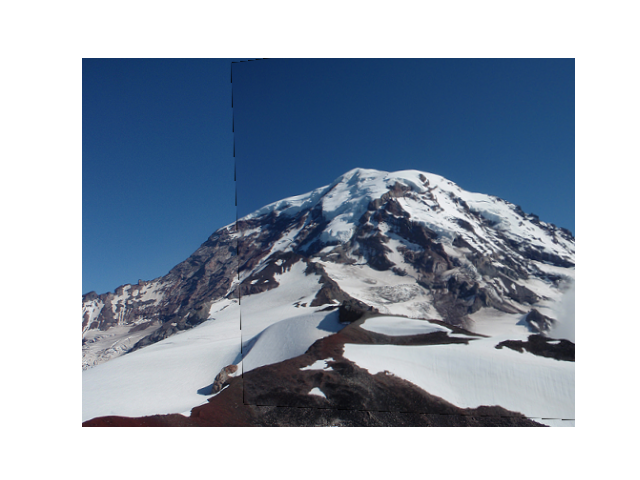

# RANSAC Report

- [RANSAC Report](#ransac-report)
  - [Sample Images Used](#sample-images-used)
  - [Comparing Models](#comparing-models)
    - [Affine Model](#affine-model)
    - [Projective Model](#projective-model)

## Sample Images Used

Below are the sample images used for the RANSAC algorithm.

**Rainier1**

**Rainier2**

## Comparing Models

### Affine Model

- Accuracy was not consistent. When tested the deviation in accuracy was moderate to high.
- Below are the results of the Affine model:

**Keypoint Matching**

**Stitching**

**Example of Inconsistency**

### Projective Model

- More accurate and consistent than the Affine model. Through testing I did not find much deviation in the accuracy of the Projective model.

**Keypoint Matching**

**Stitching**

